# Apollo 13 Decision Point Diagrams
## Large-Format Educational Poster Concepts

*For Boy Scout interactive learning experience*

---

## DIAGRAM 1: Free-Return Trajectory vs Direct Abort

### Purpose
Show the two trajectory options after the explosion, emphasizing orbital mechanics and energy requirements.

### Recommended Format: **SVG** (scalable, mathematical precision)

### Visual Elements

**Layout**: Horizontal poster (36" x 24")

**Left Side - Direct Abort Option**:
- Earth (blue sphere, left side)
- Current position of Apollo 13 (200,000 miles out)
- Red curved arrow showing retrograde burn + reversal path
- Fuel gauge showing "100% LM fuel required"
- Risk indicators: "Damaged engine", "Explosion risk"
- Time to Earth: "~40 hours"

**Right Side - Free-Return Trajectory** (chosen):
- Earth (starting point)
- Moon (right side)
- Green curved trajectory looping around Moon
- Gravity assist arrows showing Moon's pull
- Fuel gauge showing "5% LM fuel required"
- Safety indicators: "Proven mechanics", "Engine safety"
- Time to Earth: "~90 hours"

**Center Comparison**:
```
DIRECT ABORT         vs         FREE-RETURN
⚠️  High Risk                    ✓ Safer
🔥 All Fuel                      💧 Minimal Fuel
⚡ Engine Stress                 🌙 Gravity Assist
⏱️  Faster                       ⏱️  Slower
```

### Interactive Elements (for digital version)
- Animate orbital paths
- Show velocity vectors at key points
- Toggle fuel consumption overlay
- Display mission elapsed time ticker

### HTML/CSS Implementation Notes
```html
<!-- Orbital paths using SVG arcs -->
<svg viewBox="0 0 1200 800">
  <!-- Earth -->
  <circle cx="100" cy="400" r="80" fill="#4A90E2"/>

  <!-- Moon -->
  <circle cx="1000" cy="400" r="40" fill="#CCCCCC"/>

  <!-- Direct abort path (red, dashed) -->
  <path d="M 400 200 Q 250 300 100 400"
        stroke="red"
        stroke-width="4"
        stroke-dasharray="10,5"
        fill="none"/>

  <!-- Free-return trajectory (green, solid) -->
  <path d="M 400 200 Q 1000 100 1050 400 Q 1000 700 100 400"
        stroke="green"
        stroke-width="4"
        fill="none"/>

  <!-- Apollo 13 position -->
  <g id="apollo13" transform="translate(400,200)">
    <rect x="-10" y="-10" width="20" height="20" fill="white"/>
  </g>
</svg>
```

---

## DIAGRAM 2: Freeze or Squeeze - Interior Comparison

### Purpose
Show the physical space constraints and habitability of Command Module vs Lunar Module.

### Recommended Format: **HTML + CSS Grid** (better for side-by-side comparison)

### Visual Elements

**Layout**: Vertical poster (24" x 36")

**Top Half - Command Module "Odyssey"**:
- Cutaway technical drawing
- 3 crew seats shown
- 210 cubic feet notation
- Temperature gauge: "Dropping to 38°F"
- Power meter: "OFFLINE - Batteries Only"
- Systems panel: red X marks on failed systems
- Crew comfort: "Spacious but freezing"

**Bottom Half - Lunar Module "Aquarius"**:
- Cutaway technical drawing
- 2 standing positions (now with 3 crew)
- 160 cubic feet notation
- Temperature gauge: "Cold but survivable"
- Power meter: "ACTIVE - Full Systems"
- Systems panel: green checkmarks
- Crew comfort: "Cramped - can't move without disturbing others"

**Center Divider - Comparison Matrix**:
```
┌─────────────────────┬─────────────┬──────────────┐
│                     │ FREEZE (CM) │ SQUEEZE (LM) │
├─────────────────────┼─────────────┼──────────────┤
│ Space per person    │ 70 cu ft    │ 53 cu ft     │
│ Power               │ ❌ None     │ ✅ Full      │
│ Heat                │ ❌ Offline  │ ⚠️  Minimal  │
│ Oxygen              │ ⚠️  Limited │ ✅ Reserves  │
│ Life Support        │ ❌ Failed   │ ✅ Active    │
│ Can sleep?          │ ⚠️  Seated  │ ❌ Standing  │
│ Survivability       │ 0 hours     │ 96+ hours    │
└─────────────────────┴─────────────┴──────────────┘
```

### Interactive Elements
- Highlight different systems on hover
- Show crew positions (with/without 3rd person)
- Temperature animation over time
- Resource depletion meters

### HTML Structure
```html
<div class="comparison-container">
  <div class="module command-module">
    <h2>Command Module "Odyssey"</h2>
    <div class="cutaway-view">
      
      <div class="stat power">Power: OFFLINE</div>
      <div class="stat temp">38°F</div>
      <div class="stat space">210 cu ft / 3 people</div>
    </div>
  </div>

  <div class="module lunar-module">
    <h2>Lunar Module "Aquarius"</h2>
    <div class="cutaway-view">
      
      <div class="stat power">Power: ACTIVE</div>
      <div class="stat temp">Cold but survivable</div>
      <div class="stat space">160 cu ft / 3 people</div>
    </div>
  </div>
</div>
```

---

## DIAGRAM 3: Navigation Alignment - "Sun Check" Emergency Alignment

### Purpose
Show how debris field ("sparklies") prevented normal star alignment and illustrate the Sun + Earth terminator solution.

### Recommended Format: **SVG with interactive layers**

### Visual Elements

**Layout**: Horizontal poster (36" x 24")

**Left Panel - Normal Star Alignment Procedure**:
1. Guidance computer interface (retro-style)
   ```
   SELECT ALIGNMENT STAR:
   [1] SIRIUS    [11] ALDEBARAN
   [2] CANOPUS   [12] RIGEL
   [3] VEGA      [13] BETELGEUSE
   ...
   ENTER SELECTION: [_]
   ```
2. Crosshair window view showing clear star field
3. Module orientation diagram
4. Offset reading: "00-00" (perfectly aligned)

**Center Panel - Debris Field Problem ("Sparklies")**:
- Crosshair window view filled with particles
- Legend showing:
  - ⭐ Actual stars
  - ✨ Ice crystals (looks identical - "sparklies")
  - 🔩 Metal fragments (looks identical)
  - 💧 Oxygen venting (creates more debris)
- Question mark over alignment: "Which is the star?"
- Error graphic: "STAR ALIGNMENT IMPOSSIBLE"

**Right Panel - Sun + Earth Terminator Solution**:
- **GET ~73:46 "Sun Check" passed**
- Two viewing instruments:
  1. **AOT (Alignment Optical Telescope)**:
     - Shows Sun position
     - Large, unmistakable target
  2. **COAS (Crew Optical Alignment Sight)**:
     - Shows Earth's terminator (day/night line)
     - Clear boundary visible despite debris
- Diagram showing Sun in AOT aligned with Earth terminator in COAS
- Mission Control confirmation: ✓ "Platform aligned closely enough"
- Result: "Long burn after Moon approved"

### Interactive Elements (digital)
- Toggle debris field on/off
- Show view through AOT (Sun position)
- Show view through COAS (Earth terminator)
- Animate alignment verification
- Compare accuracy: star alignment vs Sun/Earth method

### SVG Implementation
```html
<svg viewBox="0 0 1200 600">
  <!-- Normal alignment window -->
  <g id="normal-view" transform="translate(100,100)">
    <circle cx="100" cy="100" r="80" fill="black"/>
    <!-- Clear stars -->
    <circle cx="80" cy="80" r="2" fill="white"/>
    <circle cx="120" cy="90" r="1" fill="white"/>
    <!-- Crosshair centered on target star -->
    <line x1="100" y1="80" x2="100" y2="120" stroke="green" stroke-width="1"/>
    <line x1="80" y1="100" x2="120" y2="100" stroke="green" stroke-width="1"/>
  </g>

  <!-- Debris field view -->
  <g id="debris-view" transform="translate(500,100)">
    <circle cx="100" cy="100" r="80" fill="black"/>
    <!-- Debris particles -->
    <circle cx="80" cy="80" r="2" fill="white" opacity="0.8"/>
    <circle cx="85" cy="95" r="1" fill="white" opacity="0.6"/>
    <circle cx="120" cy="90" r="2" fill="white" opacity="0.9"/>
    <circle cx="100" cy="100" r="1" fill="white" opacity="0.7"/>
    <!-- Many more particles -->
    <!-- Crosshair confused -->
    <line x1="100" y1="80" x2="100" y2="120" stroke="red" stroke-width="1"/>
    <line x1="80" y1="100" x2="120" y2="100" stroke="red" stroke-width="1"/>
    <text x="100" y="180" text-anchor="middle" fill="red">⚠️ WHICH IS THE STAR?</text>
  </g>

  <!-- Quadrant solution -->
  <g id="quadrant-view" transform="translate(900,100)">
    <!-- Moon with quadrant overlay -->
    <circle cx="100" cy="100" r="60" fill="#CCCCCC"/>
    <line x1="100" y1="40" x2="100" y2="160" stroke="blue" stroke-width="2"/>
    <line x1="40" y1="100" x2="160" y2="100" stroke="blue" stroke-width="2"/>
    <text x="70" y="75" fill="black">1</text>
    <text x="130" y="75" fill="black">2</text>
    <text x="70" y="135" fill="black">3</text>
    <text x="130" y="135" fill="black">4</text>
    <!-- Crosshair on quadrant 1 -->
    <circle cx="70" cy="70" r="15" fill="none" stroke="green" stroke-width="2"/>
  </g>
</svg>
```

---

## DIAGRAM 4: CO2 Scrubber "Mailbox" Assembly

### Purpose
Technical assembly diagram showing step-by-step construction of the life-saving adapter.

### Recommended Format: **HTML + detailed SVG** (IKEA-style assembly instructions)

### Visual Elements

**Layout**: Vertical poster (24" x 36")

**Top Section - The Problem**:
```
COMMAND MODULE SCRUBBER          LUNAR MODULE RECEPTACLE
┌────────────────┐                    ⭕️
│                │                 (  Round  )
│    SQUARE      │                 (         )
│  (LiOH)        │                 (  Round  )
└────────────────┘                    ⭕️

      ❌ INCOMPATIBLE ❌

Problem: LM's ROUND canisters running out (designed for 2 people)
Solution: CSM has unused SQUARE canisters, but won't fit!
```

**Middle Section - Available Materials** (laid out like parts list):
- ☐ 2x Plastic bags
- ☐ 1x Cardboard (flight manual cover)
- ☐ 1x Roll duct tape
- ☐ 2x Hoses (from space suit)
- ☐ 1x Sock (clean, hopefully)
- ☐ 1x Square CM lithium hydroxide canister

**Bottom Section - Assembly Steps** (exploded view diagram):

**Step 1**: Cut cardboard to create square-to-round adapter frame
```
[Diagram showing cardboard template with measurements]
```

**Step 2**: Attach plastic bag to one side (creates seal)
```
[Diagram showing bag taped to cardboard]
```

**Step 3**: Insert square CM canister into adapter
```
[Diagram showing canister placement]
```

**Step 4**: Attach hose to create airflow path
```
[Diagram showing hose connection]
```

**Step 5**: Sock as filter pre-stage (catches large particles)
```
[Diagram showing sock placement]
```

**Step 6**: Duct tape everything (seriously, a lot of duct tape)
```
[Diagram showing final assembly with tape reinforcement]
```

**Step 7**: Insert adapter into round LM receptacle
```
[Diagram showing installed mailbox]
```

**Result Display**:
```
CO₂ LEVELS BEFORE MAILBOX:  ████████████░░ ~14.9 mmHg (DANGER ZONE)
CO₂ LEVELS AFTER MAILBOX:   ███░░░░░░░░░░░  ~4.6 mmHg (SAFE)

(Normal: ~0-7 mmHg; Dangerous: >15 mmHg)
```

### Interactive Elements
- Step-by-step animation
- Exploded view rotation (3D)
- Material checklist (check off as found)
- CO2 meter showing real-time decline

### HTML Structure (IKEA-style)
```html
<div class="assembly-instructions">
  <div class="problem-statement">
    
    <h2>The Problem: Square Scrubber, Round Hole</h2>
  </div>

  <div class="parts-list">
    <h3>🧰 Materials Available</h3>
    <ul class="parts">
      <li><input type="checkbox"/> 2x Plastic bags</li>
      <li><input type="checkbox"/> 1x Cardboard</li>
      <li><input type="checkbox"/> 1x Duct tape</li>
      <li><input type="checkbox"/> 2x Hoses</li>
      <li><input type="checkbox"/> 1x Sock</li>
      <li><input type="checkbox"/> 1x CM canister</li>
    </ul>
  </div>

  <div class="assembly-steps">
    <div class="step" data-step="1">
      <div class="step-number">1</div>
      
      <p>Cut cardboard frame</p>
    </div>
    <!-- More steps... -->
  </div>

  <div class="result">
    <h3>✅ Success!</h3>
    <div class="co2-meter before">
      <span>Before:</span>
      <div class="bar" style="width: 96%">14.5%</div>
    </div>
    <div class="co2-meter after">
      <span>After:</span>
      <div class="bar safe" style="width: 13%">2.0%</div>
    </div>
  </div>
</div>
```

---

## DIAGRAM 5: Re-Entry Corridor - The Narrow Path Home

### Purpose
Show the narrow re-entry window and the computer restart challenge.

### Recommended Format: **SVG with animated paths**

### Visual Elements

**Layout**: Horizontal poster (36" x 24")

**Left Side - Re-Entry Corridor Diagram**:
- Earth with atmosphere layers (blue gradient)
- Three trajectory paths:
  1. **Too Steep (steeper than -7.4°)**: Red path, burns up
     - Show spacecraft burning (flames)
     - ❌ "Too hot / Too many g-forces - BURN UP"
  2. **Perfect (-6.5° target)**: Green path, safe landing
     - Show spacecraft descending safely
     - ✅ "Safe corridor - SURVIVAL"
     - Apollo 13 actual: **-6.2°** ✓
  3. **Too Shallow (less steep than -5.25°)**: Red path, bounces off
     - Show spacecraft bouncing away
     - ❌ "Insufficient drag - SKIP INTO SPACE"

**Angle Diagram Display**:
```
                 ↗ Too Shallow
                /   (Skip off atmosphere)
               /    Less steep than -5.25°
              /
    ═════════  -6.5° TARGET (green zone)
              \    Apollo 13: -6.2° ✓
               \
                \   Steeper than -7.4°
                 ↘ Too Steep (Burn up)

Safe Window: -5.25° to -7.4° (only ~2° margin!)
```

**Right Side - Computer Restart Challenge**:

**Scenario Box 1 - The Frozen Computer**:
- Computer diagram with ice crystals and condensation
- Temperature: 38-50°F (shown in blue)
- Status indicators:
  - ❄️ "Powered off: Days (since GET ~56)"
  - 💧 "Water droplets on walls"
  - 🧊 "Ice formation on circuits"
  - ⚠️ "NOT designed for restart"
  - 🔋 "Battery: Jump-started from LM"

**Decision Tree**:
```
                    ┌─ SUCCESS → Computer-guided -6.2° ✅
                    │            (Stay in corridor)
RESTART COMPUTER? ──┤
                    │
                    └─ FAILURE → Manual flight ❌
                                 (Nearly impossible after 6 days)

                    ┌─ Save battery power 🔋
                    │
MANUAL FLIGHT? ─────┤
                    │
                    └─ Precision impossible ❌
                       (Need -6.5° ± 1°, crew exhausted)
```

**Outcome Box**:
- ✅ Computer restarted successfully
- 💧 Condensation visible as systems powered up
- 🎯 Computer maintained -6.2° angle (within corridor!)
- **GET 142:40:46** - Entry Interface (400,000 ft)
- 🌊 **Splashdown: 12:07:44 p.m. CST**, near USS Iwo Jima

### Interactive Elements
- Adjust re-entry angle slider (see outcome change)
- Animate three trajectory paths
- Computer restart sequence animation
- Real Apollo 13 telemetry overlay

### SVG Implementation
```html
<svg viewBox="0 0 1200 800">
  <!-- Earth with atmosphere layers -->
  <defs>
    <radialGradient id="earth">
      <stop offset="0%" stop-color="#4A90E2"/>
      <stop offset="70%" stop-color="#2E5C8A"/>
      <stop offset="100%" stop-color="#1A1A3E"/>
    </radialGradient>
    <radialGradient id="atmosphere">
      <stop offset="0%" stop-color="transparent"/>
      <stop offset="50%" stop-color="rgba(135,206,250,0.3)"/>
      <stop offset="100%" stop-color="rgba(135,206,250,0.6)"/>
    </radialGradient>
  </defs>

  <!-- Earth -->
  <circle cx="200" cy="600" r="300" fill="url(#earth)"/>

  <!-- Atmosphere -->
  <circle cx="200" cy="600" r="380" fill="url(#atmosphere)" opacity="0.5"/>

  <!-- Too steep trajectory (burns up) -->
  <path d="M 900 100 Q 600 300 400 550"
        stroke="red"
        stroke-width="4"
        fill="none"
        stroke-dasharray="5,5">
    <animate attributeName="stroke-dashoffset"
             from="0" to="-500"
             dur="3s"
             repeatCount="indefinite"/>
  </path>
  <text x="500" y="400" fill="red">⚠️ &lt;6° BURNS UP</text>

  <!-- Perfect trajectory (6 degrees) -->
  <path d="M 900 100 Q 700 350 300 580"
        stroke="green"
        stroke-width="6"
        fill="none">
    <animate attributeName="stroke-dashoffset"
             from="0" to="-500"
             dur="3s"
             repeatCount="indefinite"/>
  </path>
  <text x="600" y="300" fill="green" font-weight="bold">✅ 6° PERFECT</text>

  <!-- Too shallow trajectory (skip off) -->
  <path d="M 900 100 Q 800 400 250 500 Q 100 450 50 300"
        stroke="red"
        stroke-width="4"
        fill="none"
        stroke-dasharray="5,5">
    <animate attributeName="stroke-dashoffset"
             from="0" to="-500"
             dur="3s"
             repeatCount="indefinite"/>
  </path>
  <text x="700" y="250" fill="red">⚠️ &gt;6° SKIP OFF</text>

  <!-- Angle protractor -->
  <g transform="translate(900,100)">
    <line x1="0" y1="0" x2="100" y2="0" stroke="black" stroke-width="2"/>
    <line x1="0" y1="0" x2="90" y2="30" stroke="green" stroke-width="2"/>
    <text x="50" y="40" fill="green" font-size="20">6°</text>
  </g>
</svg>
```

---

## DIAGRAM 6: Mission Timeline - Resource Depletion

### Purpose
Show how critical resources depleted over the mission and where each decision point occurred.

### Recommended Format: **HTML + CSS + Chart.js or D3.js**

### Visual Elements

**Layout**: Horizontal poster (48" x 24") - Extra wide for timeline

**X-Axis**: Mission Elapsed Time (0 to 142 hours)

**Y-Axis** (multiple stacked graphs):

1. **Oxygen Levels** (green/yellow/red zones)
   ```
   100% ─────────╮
                 │
                 │  ╭─── LM Reserves
    50%         │ ╱
                │╱
     0% ───────┴────────────────────
        0h    56h   80h   120h   142h
   ```

2. **Battery Power** (blue line)
   - CM batteries (drops to near zero)
   - LM batteries (gradual decline)
   - Jump-start event (sudden CM increase)

3. **CO2 Levels** (red danger zone at 15%)
   ```
    15% ─────────────────────────── DEADLY
                      ╱╲
                     ╱  ╲
    10%             ╱    ╲
                   ╱      ╰─── Mailbox installed
     5%          ╱
     0% ───────╯
        0h    56h   80h   120h   142h
   ```

4. **Water Remaining** (blue, declining)
   - Normal consumption (dashed line - runs out at 124h)
   - Actual rationing (solid line - lasts to 142h)

5. **Temperature** (red/blue gradient)
   - CM temperature drop after power-down
   - LM cold but stable

**Decision Points** marked as vertical lines with icons:
- 🚀 Launch (0h)
- 💥 Explosion (55:46h)
- 🔄 Free-return burn (61:30h)
- 🥶 Move to LM (56h)
- 📡 Quadrant navigation (70h)
- 📦 Mailbox built (80h)
- ⚡ Speed-up burn (105h)
- 🔋 Battery jump-start (138h)
- 🌊 Splashdown (142:54h)

### Interactive Elements
- Hover over any point to see exact values
- Toggle individual resource graphs on/off
- Zoom into specific time periods
- Show "what-if" scenarios (e.g., no mailbox, no rationing)

### HTML Structure with Chart.js
```html
<div class="timeline-container">
  <canvas id="resourceChart" width="1200" height="600"></canvas>
</div>

<script>
const ctx = document.getElementById('resourceChart').getContext('2d');
const chart = new Chart(ctx, {
  type: 'line',
  data: {
    labels: [0, 10, 20, 30, 40, 50, 56, 61, 70, 80, 90, 100, 105, 120, 138, 142],
    datasets: [
      {
        label: 'Oxygen %',
        data: [100, 100, 100, 100, 100, 100, 60, 55, 50, 48, 45, 40, 38, 30, 15, 5],
        borderColor: 'green',
        backgroundColor: 'rgba(0,255,0,0.1)'
      },
      {
        label: 'CO2 %',
        data: [1, 1, 1, 1, 1, 1, 2, 3, 5, 14.5, 14, 8, 5, 3, 2, 2],
        borderColor: 'red',
        backgroundColor: 'rgba(255,0,0,0.1)'
      },
      {
        label: 'Battery %',
        data: [100, 100, 100, 100, 100, 100, 10, 8, 7, 6, 5, 4, 3, 2, 40, 20],
        borderColor: 'blue',
        backgroundColor: 'rgba(0,0,255,0.1)'
      }
    ]
  },
  options: {
    annotations: {
      line1: {
        type: 'line',
        xMin: 56,
        xMax: 56,
        borderColor: 'orange',
        borderWidth: 2,
        label: {
          content: '💥 Explosion',
          enabled: true
        }
      }
    }
  }
});
</script>
```

---

## DIAGRAM 7: Spacecraft Configuration - 3-Module System

### Purpose
Show how the three modules (CM, SM, LM) connected and their individual purposes.

### Recommended Format: **SVG exploded view diagram**

### Visual Elements

**Layout**: Vertical poster (24" x 36")

**Top - Assembled Configuration** (as launched):
```
     /\
    /  \    ← Command Module "Odyssey"
   |    |      (Crew cabin, re-entry capsule)
   |    |
   |====|   ← Service Module
   |    |      (Oxygen, fuel cells, engine)
   |    |
   |    |
  /|    |\  ← Lunar Module "Aquarius"
 /_|____|_\    (Landing vehicle, backup lifeboat)
```

**Middle - Exploded View** (separated, with labels):

**Command Module** (top):
- Crew cabin (3 seats)
- Control panels
- Parachute system
- Heat shield (bottom)
- Guidance computer
- Docking hatch (top)

**Service Module** (middle):
- Oxygen tanks (Tank #2 highlighted - EXPLODED)
- Hydrogen tanks
- Fuel cells
- Main engine
- Electrical systems
- Damaged panel (blown off)

**Lunar Module** (bottom):
- Ascent stage (crew compartment)
- Descent stage (engine, fuel, landing gear)
- Life support systems
- Docking hatch (top)
- Landing radar

**Bottom - Mission Profile**:
Timeline showing when each module was used:
```
LAUNCH ──→ TRANSIT ──→ EXPLOSION ──→ LIFEBOAT ──→ RE-ENTRY
  [All]     [CM+SM]      [Damage]      [LM used]    [CM only]
                                        [SM dead]
```

### Interactive Elements
- Click modules to highlight systems
- Show jettison sequence animation
- Damage assessment overlay (what worked/failed)
- Scale comparison (show relative sizes)

---

## DIAGRAM 8: Communication - Ground to Space

### Purpose
Show the communication chain and decision-making process between crew and Mission Control.

### Recommended Format: **Mermaid flowchart** or **HTML infographic**

### Visual Elements

**Layout**: Vertical poster (24" x 36")

**Top - The Team**:
```
SPACE (200,000 miles away)              EARTH (Mission Control Houston)
┌──────────────────────┐               ┌────────────────────────────┐
│  Commander: Lovell   │               │  Flight Director: Kranz    │
│  CMP: Swigert       │◄──────────────►│  CAPCOM: Lousma/Kerwin    │
│  LMP: Haise         │   Radio Link   │  EECOM: Liebergot         │
└──────────────────────┘               │  FIDO: Deiterich          │
                                        │  GNC: Bostick             │
                                        │  + 100s of engineers      │
                                        └────────────────────────────┘
```

**Middle - Decision Loop** (for each crisis):

```mermaid
graph TD
    A[🚨 Problem Detected] --> B{Who detects?}
    B -->|Crew| C[Crew reports to Houston]
    B -->|Mission Control| D[Houston alerts crew]
    C --> E[Mission Control analyzes]
    D --> E
    E --> F[Consult specialists]
    F --> G[Develop solutions]
    G --> H[Test on simulator]
    H --> I{Will it work?}
    I -->|No| F
    I -->|Yes| J[Communicate procedure to crew]
    J --> K[Crew executes]
    K --> L{Problem solved?}
    L -->|No| A
    L -->|Yes| M[✅ Move to next challenge]
```



**Bottom - Example: CO2 Scrubber**:

Detailed timeline of one decision:
```
MET 80:00 - Crew reports: "CO2 at 13%"
            ↓
MET 80:10 - EECOM confirms: "Approaching deadly levels"
            ↓
MET 80:15 - Team assembled in back room
            ↓
MET 80:30 - Engineers gather materials matching spacecraft
            ↓
MET 81:00 - Build prototype adapter
            ↓
MET 81:30 - Test on LM simulator - WORKS
            ↓
MET 82:00 - Write step-by-step procedure
            ↓
MET 82:15 - CAPCOM reads instructions to crew
            ↓
MET 82:30 - Crew begins assembly (following radio)
            ↓
MET 83:30 - Installation complete
            ↓
MET 84:00 - CO2 dropping: 13% → 8% → 5% → 2%
            ↓
         ✅ SUCCESS
```

---

## Printing & Distribution Recommendations

### For Boy Scout Meetings:

**Large Format (Poster Size)**:
- 24" x 36" or 36" x 24"
- Professional print shop (FedEx Office, local printer)
- Laminated for durability
- Mounted on foam core for presentation

**Medium Format (Handout Size)**:
- 11" x 17" (tabloid)
- Can be printed on standard large-format printers
- Color or black & white
- Scouts can take home

**Interactive Digital**:
- HTML versions hosted online
- QR codes on physical posters link to interactive versions
- Scouts can explore on tablets/phones during meeting

### File Formats to Generate:

1. **SVG files** - Scalable to any size, perfect for printing
2. **PDF** - Standard format for print shops
3. **HTML/CSS** - Interactive digital versions
4. **PNG** (high-res, 300dpi) - Backup for compatibility

### Cost Estimates:

- **DIY Printing** (11x17): ~$2-5 per poster
- **Professional Poster** (24x36): ~$15-30 per poster
- **Lamination**: +$10-20
- **Foam Core Mounting**: +$15-25

### Scout Activity Integration:

Each diagram can be paired with activities:
- **Diagram 1**: Calculate orbital mechanics
- **Diagram 2**: Measure how many Scouts fit in taped-off areas
- **Diagram 3**: Debris field simulation game
- **Diagram 4**: Build actual mailbox from provided materials
- **Diagram 5**: Re-entry angle target game
- **Diagram 6**: Resource management decision game
- **Diagram 7**: Model rocket assembly
- **Diagram 8**: Communication relay exercise

---

## Next Steps for Implementation

1. **Choose priority diagrams** (start with 2-3)
2. **Create SVG/HTML templates**
3. **Add real mission data**
4. **Design for both print and digital**
5. **Test with Scout troop**
6. **Iterate based on feedback**
7. **Expand to full set**

Would you like me to create actual SVG or HTML implementations for any of these diagrams?
