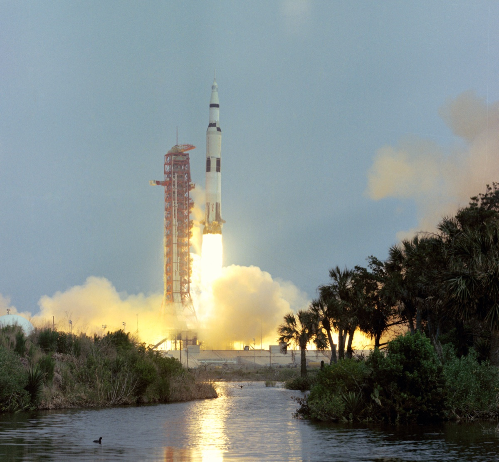

# Apollo 13 Interactive Web Experience - Technical Implementation Plan

**Version**: 1.0
**Date**: October 4, 2025
**Project**: Interactive game branch
**Target**: Zero-cost, static site with QR code access

---

## Executive Summary

This document outlines the technical implementation for converting the Apollo 13 educational poster content into an interactive web experience. The solution uses pure static HTML/CSS/JavaScript hosted on GitHub Pages for zero cost, optimized for mobile devices, and accessible via QR code.

---

## 1. Technology Stack

### 1.1 Core Technologies

```yaml
Frontend:
  HTML: HTML5 semantic markup
  CSS: CSS3 with Flexbox/Grid, CSS Variables
  JavaScript: Vanilla ES6+ (no frameworks)

Images:
  Format: WebP (primary), PNG/JPG (fallback)
  Optimization: Manual (Squoosh.app, ImageOptim)

Hosting:
  Platform: GitHub Pages
  CDN: GitHub's built-in CDN
  Domain: [username].github.io/apollo-mission/interactive/

Version Control:
  Git: Branch: interactive-game
  Repository: Existing apollo-mission repo
```

### 1.2 Why No Framework?

**Rationale**:
- ✅ Zero dependencies = no maintenance burden
- ✅ Faster loading (no framework overhead)
- ✅ Simpler deployment (no build process)
- ✅ Educational value (students can read source)
- ✅ Long-term stability (HTML/CSS/JS won't break)

**What We Avoid**:
- ❌ React/Vue/Svelte: Overkill for static content
- ❌ Build tools: Unnecessary complexity
- ❌ Node modules: Dependency hell
- ❌ Package managers: Not needed for static site

---

## 2. File Structure Implementation

### 2.1 Reorganization Plan

**Current Structure** → **New Structure**:

```
BEFORE:
/apollo-mission/
├── content/              # Mixed use
├── posters/              # One prototype
├── *.md                  # Docs scattered
└── images, etc.

AFTER:
/apollo-mission/
├── assets/               # Source materials (unchanged)
│   ├── content/          # Text files (move from /content/)
│   ├── images/           # Original images (move from /content/images/)
│   └── docs/             # All documentation (move *.md here)
│
├── static-posters/       # Print version
│   ├── templates/
│   ├── styles/
│   ├── 01-narrative-launch.html
│   ├── 02-decision-freeze-squeeze.html (move from /posters/)
│   └── [more posters...]
│
├── interactive/          # NEW - Web version
│   ├── index.html
│   ├── assets/
│   │   ├── css/
│   │   ├── js/
│   │   ├── images/      # Web-optimized
│   │   └── icons/
│   ├── slides/
│   │   └── [24 HTML pages]
│   ├── timeline.html
│   └── completion.html
│
├── .gitignore
└── README.md
```

### 2.2 Migration Commands

```bash
# 1. Create new directory structure
mkdir -p assets/{content,images,docs}
mkdir -p static-posters/{templates,styles,exports}
mkdir -p interactive/{assets/{css,js,images,icons},slides}

# 2. Move content files
mv content/* assets/content/

# 3. Move images
mv assets/content/images assets/images

# 4. Move documentation
mv *.md assets/docs/
mv assets/docs/README.md ./  # Keep root README

# 5. Move existing poster
mv posters/02-decision-freeze-or-squeeze.html static-posters/

# 6. Clean up empty directories
rmdir posters content
```

---

## 3. HTML Architecture

### 3.1 Page Template Structure

**Base Template** (all pages inherit):

```html
<!DOCTYPE html>
<html lang="en">
<head>
    <meta charset="UTF-8">
    <meta name="viewport" content="width=device-width, initial-scale=1.0">
    <meta name="description" content="Apollo 13 Interactive Mission Experience">
    <title>Apollo 13 - [Page Title]</title>

    <!-- CSS -->
    <link rel="stylesheet" href="../assets/css/style.css">

    <!-- Favicon -->
    <link rel="icon" type="image/png" href="../assets/icons/favicon.png">

    <!-- Open Graph for sharing -->
    <meta property="og:title" content="Apollo 13 Interactive Experience">
    <meta property="og:description" content="Walk through NASA's most famous rescue mission">
    <meta property="og:image" content="[URL to mission patch]">
</head>
<body class="[page-type]">
    <!-- Navigation -->
    <nav class="main-nav">
        <a href="../index.html" class="nav-home">🏠 Home</a>
        <a href="../timeline.html" class="nav-timeline">📅 Timeline</a>
        <span class="nav-progress">Slide 5 of 24</span>
    </nav>

    <!-- Main Content -->
    <main class="slide-container">
        <!-- Page-specific content here -->
    </main>

    <!-- Footer Navigation -->
    <footer class="slide-nav">
        <a href="04-previous-slide.html" class="btn-prev">← Previous</a>
        <a href="06-next-slide.html" class="btn-next">Next →</a>
    </footer>

    <!-- JavaScript -->
    <script src="../assets/js/app.js"></script>
</body>
</html>
```

### 3.2 Page Types

**1. Landing Page** (`index.html`):
```html
<main class="landing">
    <header class="hero">
        
        <h1>Apollo 13: A Successful Failure</h1>
        <p class="tagline">Experience NASA's greatest rescue mission</p>
    </header>

    <section class="mission-stats">
        <div class="stat">
            <span class="stat-icon">🚀</span>
            <span class="stat-value">5 days, 22 hours</span>
            <span class="stat-label">Mission Duration</span>
        </div>
        <!-- More stats -->
    </section>

    <section class="cta">
        <a href="slides/01-launch.html" class="btn-primary">Start Mission</a>
        <a href="timeline.html" class="btn-secondary">View Timeline</a>
    </section>
</main>
```

**2. Narrative Slide** (`slides/01-launch.html`):
```html
<article class="slide narrative">
    <header class="slide-header">
        <span class="slide-type">Chapter 1: Launch</span>
        <h1>Journey to the Moon</h1>
        <time class="timestamp">April 11, 1970 - 14:13 CST</time>
    </header>

    <figure class="slide-image">
        
        <figcaption>Saturn V lifts off from Kennedy Space Center</figcaption>
    </figure>

    <section class="slide-content">
        <h2>The Mission Begins</h2>
        <ul class="event-list">
            <li><strong>GET 00:00:00</strong> - Liftoff from Pad 39A</li>
            <li><strong>GET 00:02:42</strong> - Stage 1 separation</li>
            <li><strong>GET 00:11:53</strong> - Earth orbit achieved</li>
        </ul>

        <details class="learn-more">
            <summary>Learn More About the Saturn V Rocket</summary>
            <p>Additional technical details here...</p>
        </details>
    </section>
</article>
```

**3. Decision Slide** (`slides/02-freeze-squeeze.html`):
```html
<article class="slide decision">
    <header class="slide-header">
        <span class="slide-type">Decision Point #2</span>
        <h1>Freeze or Squeeze?</h1>
        <time class="timestamp">GET 56:00:00</time>
    </header>

    <section class="situation">
        <h2>⚠️ The Situation</h2>
        <ul>
            <li>Command Module losing power rapidly</li>
            <li>Temperature will drop to freezing</li>
            <li>Lunar Module designed for 2, not 3</li>
        </ul>
    </section>

    <section class="options">
        <div class="option" data-option="freeze">
            <h3>Stay in Command Module</h3>
            <p class="option-subtitle">More space, but no power</p>
            <button class="btn-choose">Choose This Option</button>

            <div class="option-details">
                <div class="pros">
                    <h4>✓ Advantages</h4>
                    <ul>
                        <li>More spacious (~210 cubic feet)</li>
                        <li>Familiar systems</li>
                    </ul>
                </div>
                <div class="cons">
                    <h4>✕ Disadvantages</h4>
                    <ul>
                        <li>No power = no heat</li>
                        <li>Won't survive 4 days</li>
                    </ul>
                </div>
            </div>
        </div>

        <div class="option" data-option="squeeze">
            <!-- Similar structure for option 2 -->
        </div>
    </section>

    <section class="decision-result hidden" id="result">
        <h2>NASA's Decision</h2>
        <div class="result-content">
            <p class="result-choice">✓ Move to Lunar Module (SQUEEZE)</p>
            <p>The crew powered down the Command Module and moved to the Lunar Module "Aquarius," using it as a lifeboat for the journey home.</p>
            <blockquote>"It was so cold, moisture condensed on the walls."<cite>- Jim Lovell</cite></blockquote>
        </div>
    </section>
</article>
```

**4. Info Slide** (`slides/03-spacecraft.html`):
```html
<article class="slide info">
    <header class="slide-header">
        <span class="slide-type">Background Information</span>
        <h1>Spacecraft Configuration</h1>
    </header>

    <section class="info-grid">
        <div class="info-visual">
            
        </div>

        <div class="info-content">
            <details open class="info-section">
                <summary>Command Module (Odyssey)</summary>
                <ul>
                    <li>Crew living space during flight</li>
                    <li>Only module with heat shield</li>
                    <li>Controls for entire spacecraft</li>
                </ul>
            </details>

            <details class="info-section">
                <summary>Service Module</summary>
                <ul>
                    <li>Oxygen tanks (one exploded)</li>
                    <li>Main engine for maneuvers</li>
                    <li>Electrical power system</li>
                </ul>
            </details>

            <details class="info-section">
                <summary>Lunar Module (Aquarius)</summary>
                <ul>
                    <li>Designed to land on Moon</li>
                    <li>Became lifeboat after explosion</li>
                    <li>Limited power and consumables</li>
                </ul>
            </details>
        </div>
    </section>
</article>
```

**5. Timeline Page** (`timeline.html`):
```html
<main class="timeline-view">
    <h1>Mission Timeline</h1>

    <div class="timeline">
        <div class="timeline-event" data-day="1">
            <div class="event-marker">Day 1</div>
            <div class="event-content">
                <h3>Launch & Outbound</h3>
                <ul class="event-links">
                    <li><a href="slides/01-launch.html">Mission Overview</a></li>
                    <li><a href="slides/02-crew.html">Meet the Crew</a></li>
                </ul>
            </div>
        </div>

        <div class="timeline-event crisis" data-day="3">
            <div class="event-marker">Day 3</div>
            <div class="event-content">
                <h3>⚡ Crisis Begins</h3>
                <ul class="event-links">
                    <li><a href="slides/03-explosion.html">The Explosion</a></li>
                    <li><a href="slides/05-decision-turn.html">Decision: Turn Around?</a></li>
                    <!-- More links -->
                </ul>
            </div>
        </div>

        <!-- More timeline events -->
    </div>
</main>
```

---

## 4. CSS Architecture

### 4.1 CSS Organization

```
assets/css/
├── style.css               # Main stylesheet (all others imported here)
└── (OR break into modules:)
    ├── reset.css           # CSS reset/normalize
    ├── variables.css       # CSS custom properties
    ├── typography.css      # Font styles
    ├── layout.css          # Grid, flexbox layouts
    ├── components.css      # Buttons, cards, etc.
    ├── slides.css          # Slide-specific styles
    └── responsive.css      # Media queries
```

### 4.2 CSS Variables

```css
:root {
    /* Colors (from poster design) */
    --nasa-blue: #0B3D91;
    --mission-white: #FFFFFF;
    --apollo-black: #000000;
    --crisis-red: #DC143C;
    --success-green: #2E7D32;
    --caution-yellow: #FFA000;
    --info-cyan: #00ACC1;

    /* Backgrounds */
    --bg-light: #F5F5F5;
    --bg-blue-light: #E3F2FD;
    --bg-yellow-light: #FFF9C4;

    /* Spacing */
    --space-xs: 0.5rem;    /* 8px */
    --space-sm: 1rem;      /* 16px */
    --space-md: 1.5rem;    /* 24px */
    --space-lg: 2rem;      /* 32px */
    --space-xl: 3rem;      /* 48px */

    /* Typography */
    --font-body: -apple-system, BlinkMacSystemFont, 'Segoe UI', Roboto, 'Helvetica Neue', Arial, sans-serif;
    --font-mono: 'Courier New', Courier, monospace;

    --text-xs: 0.875rem;   /* 14px */
    --text-sm: 1rem;       /* 16px */
    --text-md: 1.125rem;   /* 18px */
    --text-lg: 1.5rem;     /* 24px */
    --text-xl: 2rem;       /* 32px */
    --text-2xl: 3rem;      /* 48px */

    /* Layout */
    --max-width: 1200px;
    --content-width: 800px;
    --border-radius: 8px;
    --shadow: 0 2px 8px rgba(0,0,0,0.1);
}
```

### 4.3 Responsive Design Strategy

**Mobile First Approach**:

```css
/* Base styles: Mobile (320px+) */
.slide-container {
    padding: 1rem;
    font-size: 16px;
}

/* Tablet (768px+) */
@media (min-width: 768px) {
    .slide-container {
        padding: 2rem;
        font-size: 18px;
    }
}

/* Desktop (1024px+) */
@media (min-width: 1024px) {
    .slide-container {
        max-width: var(--max-width);
        margin: 0 auto;
        padding: 3rem;
    }
}
```

### 4.4 Key Component Styles

**Decision Options**:
```css
.options {
    display: grid;
    gap: var(--space-lg);
}

@media (min-width: 768px) {
    .options {
        grid-template-columns: 1fr 1fr;
    }
}

.option {
    background: var(--bg-light);
    border: 3px solid var(--info-cyan);
    border-radius: var(--border-radius);
    padding: var(--space-lg);
    transition: transform 0.2s, box-shadow 0.2s;
}

.option:hover {
    transform: translateY(-4px);
    box-shadow: var(--shadow);
}

.option.selected {
    border-color: var(--nasa-blue);
    background: var(--bg-blue-light);
}
```

**Timeline**:
```css
.timeline {
    position: relative;
    padding-left: 2rem;
}

.timeline::before {
    content: '';
    position: absolute;
    left: 0;
    top: 0;
    bottom: 0;
    width: 4px;
    background: var(--nasa-blue);
}

.timeline-event {
    position: relative;
    margin-bottom: var(--space-xl);
}

.event-marker {
    position: absolute;
    left: -2.5rem;
    width: 3rem;
    height: 3rem;
    background: var(--nasa-blue);
    color: white;
    border-radius: 50%;
    display: flex;
    align-items: center;
    justify-content: center;
    font-weight: bold;
}

.timeline-event.crisis .event-marker {
    background: var(--crisis-red);
}
```

---

## 5. JavaScript Architecture

### 5.1 Core Functionality

**Main App** (`assets/js/app.js`):

```javascript
// Simple app initialization
document.addEventListener('DOMContentLoaded', () => {
    initNavigation();
    initDecisions();
    initProgressTracking();
    initKeyboardNav();
});

// Navigation between slides
function initNavigation() {
    // Smooth scroll to top on page load
    window.scrollTo(0, 0);

    // Add loading states to links
    document.querySelectorAll('a[href$=".html"]').forEach(link => {
        link.addEventListener('click', (e) => {
            // Optional: Show loading indicator
            sessionStorage.setItem('previousPage', window.location.pathname);
        });
    });
}

// Decision slide interaction
function initDecisions() {
    const options = document.querySelectorAll('.option');
    const result = document.getElementById('result');

    if (!options.length) return; // Not a decision page

    options.forEach(option => {
        const button = option.querySelector('.btn-choose');
        button?.addEventListener('click', () => {
            // Mark selected
            options.forEach(opt => opt.classList.remove('selected'));
            option.classList.add('selected');

            // Show result
            result?.classList.remove('hidden');
            result?.scrollIntoView({ behavior: 'smooth', block: 'start' });

            // Track decision (localStorage)
            const slideId = document.body.dataset.slideId;
            const choice = option.dataset.option;
            saveDecision(slideId, choice);
        });
    });
}

// Progress tracking
function initProgressTracking() {
    const slideId = document.body.dataset.slideId;
    if (!slideId) return;

    // Get or create visited slides set
    const visited = new Set(JSON.parse(localStorage.getItem('visitedSlides') || '[]'));
    visited.add(slideId);
    localStorage.setItem('visitedSlides', JSON.stringify([...visited]));

    // Update progress indicator
    const total = 24;
    const current = parseInt(slideId) || 1;
    const progressText = document.querySelector('.nav-progress');
    if (progressText) {
        progressText.textContent = `Slide ${current} of ${total}`;
    }
}

// Keyboard navigation
function initKeyboardNav() {
    document.addEventListener('keydown', (e) => {
        const prevLink = document.querySelector('.btn-prev');
        const nextLink = document.querySelector('.btn-next');

        if (e.key === 'ArrowLeft' && prevLink) {
            prevLink.click();
        } else if (e.key === 'ArrowRight' && nextLink) {
            nextLink.click();
        }
    });
}

// Save decision to localStorage
function saveDecision(slideId, choice) {
    const decisions = JSON.parse(localStorage.getItem('decisions') || '{}');
    decisions[slideId] = {
        choice: choice,
        timestamp: new Date().toISOString()
    };
    localStorage.setItem('decisions', JSON.stringify(decisions));
}

// Get all decisions (for completion page)
function getDecisions() {
    return JSON.parse(localStorage.getItem('decisions') || '{}');
}
```

**Completion Page Script** (`slides/completion.html` inline):

```javascript
// Show summary of decisions made
const decisions = getDecisions();
const decisionList = document.getElementById('decision-summary');

Object.entries(decisions).forEach(([slideId, data]) => {
    const item = document.createElement('li');
    item.textContent = `Decision ${slideId}: ${data.choice}`;
    decisionList.appendChild(item);
});

// Share functionality
document.getElementById('share-btn')?.addEventListener('click', async () => {
    const url = window.location.origin + window.location.pathname;

    if (navigator.share) {
        // Mobile share API
        await navigator.share({
            title: 'Apollo 13 Interactive Experience',
            text: 'I just completed the Apollo 13 mission!',
            url: url
        });
    } else {
        // Fallback: Copy to clipboard
        await navigator.clipboard.writeText(url);
        alert('Link copied to clipboard!');
    }
});
```

### 5.2 Progressive Enhancement

**Without JavaScript**:
- All navigation works (plain HTML links)
- Content is fully accessible
- Decision slides show all options (no interactivity)
- Timeline is a simple list

**With JavaScript**:
- Smooth transitions
- Progress tracking
- Decision reveal animations
- Keyboard shortcuts
- Local storage for progress

---

## 6. Image Optimization

### 6.1 Optimization Process

**Tools**:
- [Squoosh.app](https://squoosh.app/) - Web-based image optimizer
- ImageOptim (Mac) - Drag-and-drop optimizer
- cwebp (CLI) - Convert to WebP

**Workflow**:
```bash
# For each image in assets/images/

# 1. Resize to max width (if larger than 1200px)
sips -Z 1200 slide01_launch.jpg

# 2. Convert to WebP
cwebp -q 80 slide01_launch.jpg -o slide01_launch.webp

# 3. Keep optimized JPG as fallback
# (Use ImageOptim or Squoosh to compress)

# 4. Copy to interactive/assets/images/
cp slide01_launch.webp ../interactive/assets/images/
cp slide01_launch.jpg ../interactive/assets/images/
```

### 6.2 HTML Picture Element

```html
<picture>
    <source srcset="assets/images/launch.webp" type="image/webp">
    
</picture>
```

### 6.3 Target Sizes

| Image Type | Original | Optimized | Format |
|------------|----------|-----------|--------|
| Hero images | 6.5MB (6000px) | <150KB (1200px) | WebP + JPG |
| Diagrams | 400KB (2000px) | <80KB (800px) | WebP + PNG |
| Thumbnails | - | <30KB (400px) | WebP + JPG |
| Icons | - | SVG or <10KB PNG | SVG preferred |

---

## 7. Deployment

### 7.1 GitHub Pages Setup

**Initial Setup**:

1. **Enable GitHub Pages**:
   ```
   Repo Settings → Pages
   Source: Deploy from branch
   Branch: interactive-game
   Folder: / (root)
   ```

2. **Configure Path**:
   - Site will be at: `https://[username].github.io/apollo-mission/`
   - Interactive version: `https://[username].github.io/apollo-mission/interactive/`

3. **Custom Domain** (Optional):
   - Add CNAME file: `apollo13.yourdomain.com`
   - Configure DNS: CNAME → `[username].github.io`

### 7.2 Deployment Workflow

```bash
# 1. Develop in interactive-game branch
git checkout interactive-game

# 2. Make changes
# ... edit files ...

# 3. Test locally (optional - use VS Code Live Server)
# Just open index.html in browser

# 4. Commit and push
git add .
git commit -m "Add landing page and first 3 slides"
git push origin interactive-game

# 5. GitHub automatically deploys
# Wait 1-2 minutes, then visit:
# https://[username].github.io/apollo-mission/interactive/
```

### 7.3 Testing Checklist

**Before Each Deploy**:
- [ ] All links work (no 404s)
- [ ] Images load correctly
- [ ] Test on mobile device
- [ ] Test in Safari (iOS)
- [ ] Test in Chrome (Android)
- [ ] Check page load speed (Chrome DevTools)
- [ ] Validate HTML (validator.w3.org)
- [ ] Check accessibility (Lighthouse)

---

## 8. QR Code Generation

### 8.1 QR Code Tools

**Recommended**:
- [QR Code Generator](https://www.qr-code-generator.com/) - High-quality SVG export
- [QRCode Monkey](https://www.qrcode-monkey.com/) - Custom styling
- CLI: `qrencode -o apollo13.png -s 10 "[URL]"`

### 8.2 QR Code Specifications

```yaml
URL: https://[username].github.io/apollo-mission/interactive/
Format: SVG (vector) or PNG at 1000x1000px minimum
Error Correction: Level H (30% recoverable)
Quiet Zone: 4 modules (white border)
Colors: Black on white (best contrast)
Testing: Scan with multiple devices/apps
```

### 8.3 QR Code Placement Ideas

1. **Handout Card** (Business card size):
   ```
   Front: Mission patch + "Scan to explore Apollo 13"
   Back: Large QR code
   ```

2. **Poster Addition**:
   ```
   Bottom right corner of each physical poster
   2" x 2" QR code
   Caption: "Continue online →"
   ```

3. **Bookmark**:
   ```
   2" wide x 6" tall
   QR at bottom
   Mission facts above
   ```

---

## 9. Performance Optimization

### 9.1 Performance Budget

**Targets**:
- Total page weight: <500KB
- Lighthouse score: >90 (all categories)
- First Contentful Paint: <1.5s
- Time to Interactive: <3s

### 9.2 Optimization Techniques

**HTML**:
- Minify (optional, low priority for static site)
- Semantic markup reduces bloat
- Inline critical CSS (above-the-fold)

**CSS**:
- Remove unused styles
- Use CSS variables instead of repeated values
- Single stylesheet (reduce HTTP requests)

**JavaScript**:
- Keep minimal (<10KB)
- No external libraries
- Defer non-critical scripts

**Images**:
- Lazy loading: `loading="lazy"`
- WebP format with JPG fallback
- Proper sizing (don't rely on CSS resize)
- Compress aggressively

**Fonts**:
- Use system fonts (no web fonts = faster)
- `font-display: swap` if using web fonts

### 9.3 Lighthouse Checklist

```bash
# Run Lighthouse in Chrome DevTools
# Or use CLI:
lighthouse https://[username].github.io/apollo-mission/interactive/ \
  --output html --output-path ./lighthouse-report.html

# Target scores:
# Performance: >90
# Accessibility: >95
# Best Practices: >90
# SEO: >90
```

---

## 10. Accessibility

### 10.1 WCAG 2.1 AA Requirements

**Color Contrast**:
- Normal text: 4.5:1 minimum
- Large text (24px+): 3:1 minimum
- Test: WebAIM Contrast Checker

**Semantic HTML**:
```html
<!-- Good -->
<nav>, <main>, <article>, <section>, <aside>, <header>, <footer>

<!-- Bad -->
<div class="nav">, <div class="main">
```

**Alt Text**:
```html
<!-- Decorative image -->


<!-- Informative image -->


<!-- Complex diagram -->
<figure>
    
    <figcaption>Detailed description of orbital path...</figcaption>
</figure>
```

**Keyboard Navigation**:
- All interactive elements focusable
- Logical tab order
- Visible focus indicators
- No keyboard traps

**ARIA Labels**:
```html
<button aria-label="Choose to stay in Command Module">
    Choose This Option
</button>

<nav aria-label="Main navigation">
    <!-- nav items -->
</nav>
```

### 10.2 Screen Reader Testing

**Tools**:
- VoiceOver (Mac/iOS) - Cmd+F5
- NVDA (Windows) - Free
- JAWS (Windows) - Commercial

**Test Scenarios**:
- Navigate site with keyboard only
- Read page with screen reader
- Ensure all content is announced
- Verify link/button descriptions make sense

---

## 11. Browser & Device Testing

### 11.1 Target Browsers

**Tier 1** (must work perfectly):
- Chrome 100+ (Windows, Mac, Android)
- Safari 15+ (Mac, iOS)
- Firefox 100+ (Windows, Mac)
- Edge 100+ (Windows)

**Tier 2** (graceful degradation):
- Older browsers (show content, no fancy features)
- IE11 (basic HTML only, no JS enhancements)

### 11.2 Device Testing

**Physical Devices**:
- iPhone (Safari) - Test touch interactions
- Android phone (Chrome) - Test QR code scan
- iPad (Safari) - Test tablet layout
- Desktop (various browsers) - Full experience

**Browser DevTools**:
- Chrome Device Mode - Test responsive layouts
- Safari Responsive Design Mode
- Firefox Responsive Design Mode

### 11.3 Testing Checklist

```
[ ] iPhone Safari - Portrait
[ ] iPhone Safari - Landscape
[ ] Android Chrome - Portrait
[ ] iPad - Portrait & Landscape
[ ] Desktop Chrome - 1920x1080
[ ] Desktop Safari - 1920x1080
[ ] Desktop Firefox - 1920x1080
[ ] Slow 3G throttling (Chrome DevTools)
```

---

## 12. Content Migration Strategy

### 12.1 Conversion Process

**For Each Content File**:

1. **Read source** (`assets/content/decision/02-freeze-or-squeeze.txt`)
2. **Parse structure**:
   ```
   === THE SITUATION === → <section class="situation">
   === OPTION 1 === → <div class="option">
   PROS: → <div class="pros">
   ```
3. **Generate HTML** (manual or script)
4. **Add navigation** (prev/next links)
5. **Optimize image** (if slide has one)
6. **Test in browser**
7. **Commit to git**

### 12.2 Content Reduction Guidelines

**Narrative Slides**:
- Keep: Timeline, 3-5 key events, primary image
- Reduce: Detailed timestamps, extended descriptions
- Add: "Learn More" expandable section

**Decision Slides**:
- Keep: All PROS/CONS (essential for decision-making)
- Reduce: Number of bullets (top 3-4 per category)
- Add: Historical decision reveal interaction

**Info Slides**:
- Keep: Main concept, primary diagram
- Reduce: Technical depth (make expandable)
- Add: Accordion sections for sub-topics

### 12.3 Batch Processing Script (Optional)

```python
# assets/scripts/convert_content.py
# Simple script to convert .txt files to HTML

import os
from pathlib import Path

def parse_content_file(filepath):
    """Parse structured text file into sections"""
    with open(filepath, 'r') as f:
        content = f.read()

    sections = {}
    current_section = None

    for line in content.split('\n'):
        if line.startswith('==='):
            current_section = line.strip('= ')
            sections[current_section] = []
        elif current_section:
            sections[current_section].append(line)

    return sections

def generate_html(sections, template):
    """Fill template with content"""
    # Template replacement logic
    pass

# Run for all content files
for txt_file in Path('assets/content/decision').glob('*.txt'):
    sections = parse_content_file(txt_file)
    html = generate_html(sections, 'templates/decision.html')
    # Save to interactive/slides/
```

---

## 13. Maintenance & Updates

### 13.1 Content Updates

**Process**:
1. Edit source files in `assets/content/`
2. Regenerate HTML in `interactive/slides/`
3. Test changes
4. Commit and push
5. GitHub Pages auto-deploys

**Version Control**:
```bash
# Tag releases
git tag -a v1.0 -m "Initial release"
git push origin v1.0

# Track major changes
git log --oneline
```

### 13.2 Long-term Stability

**Considerations**:
- GitHub Pages is free and stable (been around since 2008)
- Static HTML/CSS/JS has no dependencies to break
- No frameworks to update or maintain
- Content is version-controlled and backed up

**Backup Strategy**:
- Git repository is primary backup
- Export to ZIP periodically
- Archive on external drive/cloud storage

---

## 14. Success Metrics

### 14.1 Technical Metrics

**Launch Criteria**:
- [ ] All 24 slides converted and accessible
- [ ] Site loads in <3 seconds on 3G
- [ ] Mobile responsive (320px to 1920px)
- [ ] Lighthouse score >90 (all categories)
- [ ] Zero console errors
- [ ] QR code successfully launches site

### 14.2 User Metrics (Post-Launch)

**Track via**:
- GitHub Pages analytics (if enabled)
- Google Analytics (optional, privacy-friendly setup)
- Manual feedback from scouts/leaders

**Key Questions**:
- How many scans/visits?
- Average time on site?
- Completion rate?
- Mobile vs desktop usage?

---

## 15. Timeline & Milestones

### Week 1: Foundation
**Goal**: Working prototype

- [ ] Day 1: Reorganize directory structure
- [ ] Day 2: Create landing page + styles
- [ ] Day 3: Build 3 sample slides (1 of each type)
- [ ] Day 4: Set up GitHub Pages deployment
- [ ] Day 5: Generate QR code and test

**Deliverable**: 3-page prototype accessible via QR code

### Week 2-3: Content Migration
**Goal**: All 24 slides

- [ ] Week 2: Convert all 10 decision slides
- [ ] Week 2: Convert all 6 narrative slides
- [ ] Week 3: Convert all 8 info slides
- [ ] Week 3: Build timeline page
- [ ] Week 3: Build completion page

**Deliverable**: Complete 24-slide experience

### Week 4: Polish
**Goal**: Production ready

- [ ] Optimize all images
- [ ] Test on multiple devices
- [ ] Accessibility audit
- [ ] Performance optimization
- [ ] User testing with 2-3 scouts

**Deliverable**: Polished, tested site

### Week 5: Launch
**Goal**: Make it accessible

- [ ] Final deployment
- [ ] Generate and print QR codes
- [ ] Create handout materials
- [ ] Write usage guide
- [ ] Announce to scout groups

**Deliverable**: Live site + promotional materials

---

## 16. Next Steps

### Immediate Actions

1. **Review this plan** with stakeholders
2. **Reorganize directory structure** (move files as outlined)
3. **Create landing page** (`interactive/index.html`)
4. **Build first 3 slides**:
   - Narrative: Launch
   - Decision: Freeze or Squeeze
   - Info: Spacecraft Configuration
5. **Deploy to GitHub Pages**
6. **Test QR code access**

### Questions to Resolve

- [ ] Confirm GitHub username for Pages URL
- [ ] Decide on custom domain (optional)
- [ ] Preferred QR code style/placement
- [ ] User testing volunteers (scouts to test with)

---

## Appendix A: Useful Commands

```bash
# Create directory structure
mkdir -p assets/{content,images,docs} static-posters/{templates,styles} interactive/{assets/{css,js,images,icons},slides}

# Find large images
find assets/images -type f -size +1M -exec ls -lh {} \;

# Optimize image (macOS)
sips -Z 1200 input.jpg --out output.jpg

# Convert to WebP (requires cwebp)
cwebp -q 80 input.jpg -o output.webp

# Start simple HTTP server for local testing
python3 -m http.server 8000
# Visit: http://localhost:8000/interactive/

# Validate HTML
# Use: https://validator.w3.org/nu/

# Check accessibility
# Use: https://wave.webaim.org/

# Generate QR code (requires qrencode)
qrencode -o apollo13-qr.png -s 10 "https://username.github.io/apollo-mission/interactive/"
```

---

## Appendix B: Resources

**Tools**:
- [Squoosh](https://squoosh.app/) - Image optimization
- [WebAIM Contrast Checker](https://webaim.org/resources/contrastchecker/)
- [Lighthouse](https://developers.google.com/web/tools/lighthouse)
- [Can I Use](https://caniuse.com/) - Browser compatibility
- [W3C HTML Validator](https://validator.w3.org/)

**Learning**:
- [MDN Web Docs](https://developer.mozilla.org/) - HTML/CSS/JS reference
- [Web.dev](https://web.dev/) - Performance guides
- [A11y Project](https://www.a11yproject.com/) - Accessibility

**GitHub Pages**:
- [GitHub Pages Docs](https://docs.github.com/en/pages)
- [Custom Domain Setup](https://docs.github.com/en/pages/configuring-a-custom-domain-for-your-github-pages-site)

---

**Document Status**: Ready for implementation
**Next Action**: Begin directory reorganization and create landing page

---

*This technical plan provides step-by-step implementation details for the Apollo 13 Interactive Web Experience. Follow this plan alongside INTERACTIVE_REQUIREMENTS.md for successful deployment.*
