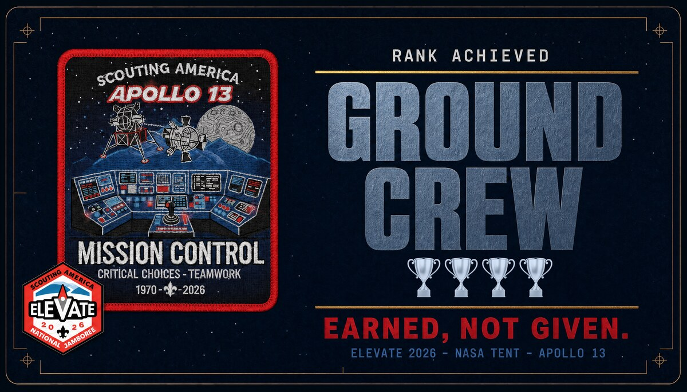
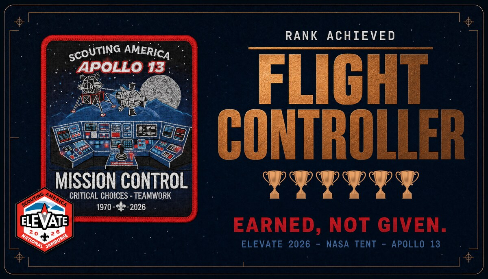
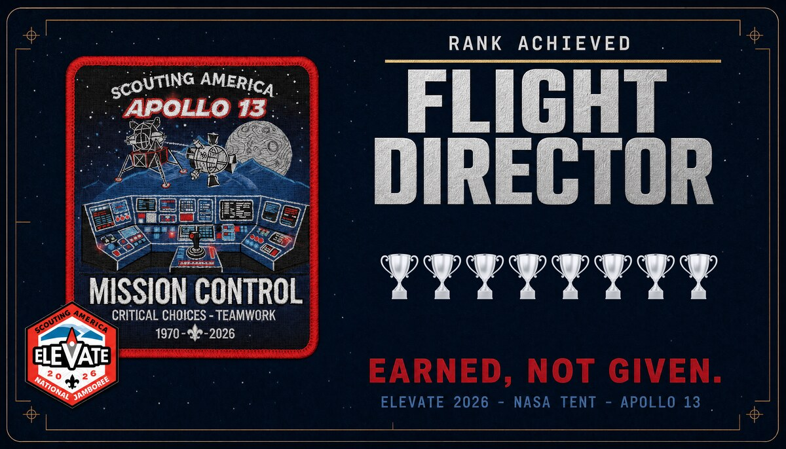
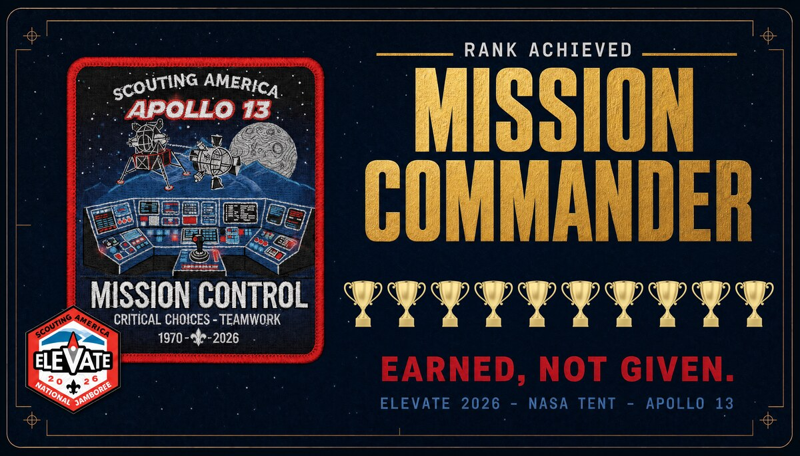

# The Jamboree Exhibit

This folder documents the **physical half** of the Apollo 13 project: the table at the
NASA Tent at the **2026 Elevate Scout Jamboree**, staffed by Ed Gruhl (Scout District
Commissioner, Glacial Trails District).

The exhibit and this repository work together:

1. A scout walks past the NASA tent and sees the posters.
2. They scan the QR code (or take an invitation card for later).
3. Their phone opens the [interactive web experience](https://apollo13.quest/) — the code in this repo.
4. They make the 10 real decisions NASA faced and earn a rank.
5. They earn a **rank card matching their score** — Ground Crew (4), Flight Controller (6),
   Flight Director (8), or Mission Commander (10). The completion page tells them to show
   their screen at the Apollo Table to collect it.

> **Reward model — updated 2026-07-05 (Ed's note):** the single "Mission Commander" reward
> card was replaced by **four rank cards** (trophy counts 4/6/8/10, cards from score 4).
> Poster 1 ("Score 4+ trophies. Earn your rank card." / "One card per rank.") and the web
> app completion banner (names the earned rank card from score 4) were aligned the same day.

---

## Poster 1 — "Can YOU bring them home?" (attract panel)

The hook. 36″×48″, mounted at the table. Shows a crisp, high-resolution rendering of the
damaged Service Module — reimagined with gpt-image-2 from the real 1970 NASA photograph
(AS13-59), which was too grainy/soft to print large (refreshed 2026-07-05) — the stakes
("10 decisions. 3 lives. Your call."), the four ranks, and a large **SCAN TO TAKE COMMAND** QR code.

## Poster 2 — "The Computer Rescue Mission" (briefing panel)

The deep-dive companion. 36″×48″. Tells the computing story behind the rescue — MIT
Instrumentation Laboratory guidance design, AC Electronics as the **guidance prime**
contractor (AC Spark Plug Div. of GM; relabeled from "system integrator" 2026-07-05),
Raytheon's core rope memory, IBM's Saturn V computer — and the numbers that stun modern kids:
**4 KB of RAM, 72 KB of ROM**, 200,000 miles from Earth.

## Invitation card (hand-out)

Business card scouts take with them. Front mirrors the poster hook; the QR code opens
the web experience. "Free · Any phone · No app."

## Rank cards — "Earned, not given." (four tiers)

|  |  |
|---|---|
| **Ground Crew** — 4 🏆 (steel) · score 4–5 | **Flight Controller** — 6 🏆 (bronze) · score 6–7 |
|  |  |
| **Flight Director** — 8 🏆 (platinum) · score 8–9 | **Mission Commander** — 10 🏆 (gold) · score 10 |

The take-home trophy, handed out at the Apollo Table to match the scout's score. One shared
design system (navy flight-certificate, embroidered Mission Control patch, "Earned, not given.")
differentiated by rank name, metal color, and a composited row of trophies (the count = the rank).
**No QR** on purpose — they're trophies, not ads. Single-sided, CMYK color (no foil).

## QR codes

`qr-code.png` (2294×2294 px — use for print) and `qr-code-small.png` (1480×1480 px —
for cards/web) decode to **`https://apollo13.quest/`** (regenerated 2026-07-05 for the
custom domain; zbarimg-verified, error correction Q). The QR codes baked into the
current print masters (poster 1 + invitation card) also decode to `https://apollo13.quest/`
(re-verified with zbarimg 2026-07-05 after the poster 1 reward-block edit). If you
regenerate any piece, use these files and keep dark-on-white — inverted QR codes fail
on many phone cameras.

---

## Print specifications

| Piece | Print size | Master resolution |
|---|---|---|
| Poster 1 (attract) | 36″ × 48″ | 10800 × 14400 px @ 300 dpi |
| Poster 2 (computer rescue) | 36″ × 48″ | 10800 × 14400 px @ 300 dpi |
| Invitation / QR card | 3.5″ × 2″ + bleed | 4080 × 2448 px (includes ⅛″ bleed) |
| Rank cards (×4) | 3.5″ × 2″ (trim) | 3808 × 2176 px (bleed TBD) |

Cards: 350gsm+ stock. The images here are **web previews only** — the full-resolution
print masters live in this repo at [`../print-ready/`](../print-ready/) (canonical as
of 2026-07-05). Design sources, drafts, and the design brief remain in the private
`apollo-working-materials` archive.
