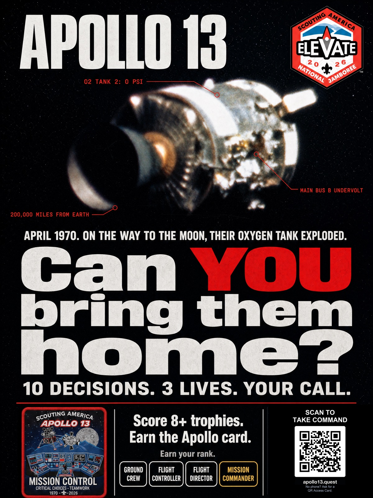
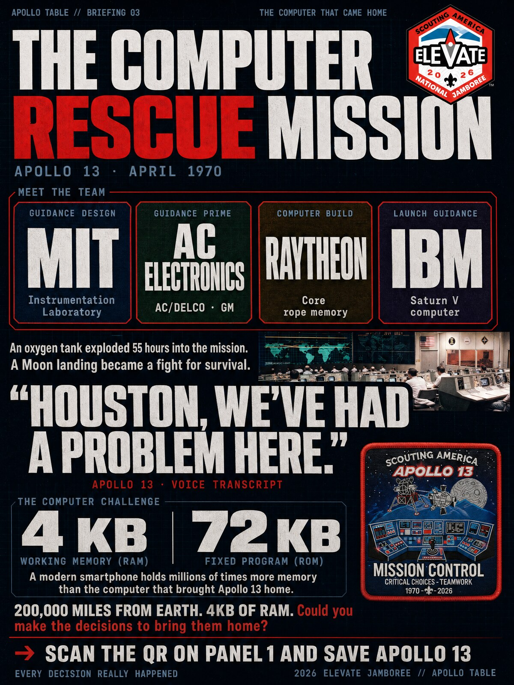
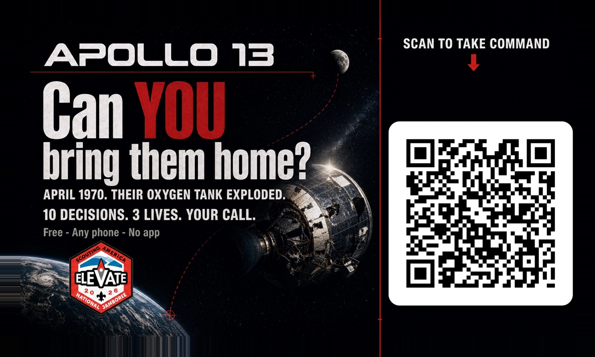
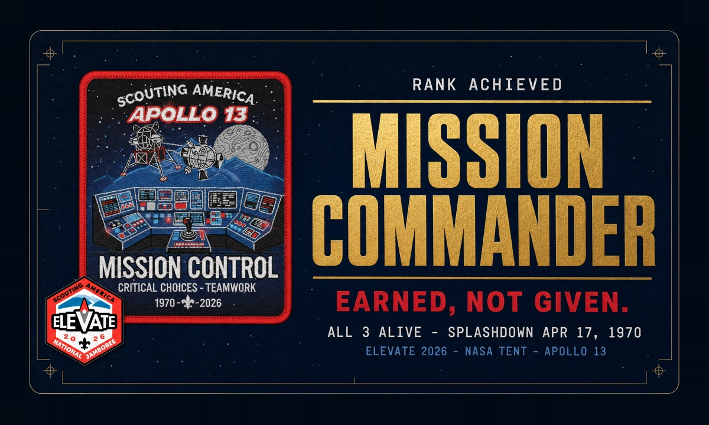

# The Jamboree Exhibit

This folder documents the **physical half** of the Apollo 13 project: the table at the
NASA Tent at the **2026 Elevate Scout Jamboree**, staffed by Ed Gruhl (Scout District
Commissioner, Glacial Trails District).

The exhibit and this repository work together:

1. A scout walks past the NASA tent and sees the posters.
2. They scan the QR code (or take an invitation card for later).
3. Their phone opens the [interactive web experience](https://apollo13.quest/) — the code in this repo.
4. They make the 10 real decisions NASA faced and earn a rank.
5. Scouts who score 8+ correct earn the **Apollo reward card** — excellent, but
   perfection not required. The completion page tells them to show their screen
   at the Apollo Table.

> ⚠️ **Poster discrepancy — partially resolved**: `poster-1-attract-preview.jpg` in
> this repo now says "Score 8+ trophies" (updated 2026-07-05, masked gpt-image-2 edit,
> QR re-verified). The full-resolution **print masters** (~170 MB, private
> `apollo-working-materials` archive) still say 5+ and have not been regenerated —
> do that (or brief Ed to honor 8+ regardless of what's printed) before ordering prints.

---

## Poster 1 — "Can YOU bring them home?" (attract panel)

The hook. 36″×48″, mounted at the table. Shows the real photograph of the damaged
Service Module, the stakes ("10 decisions. 3 lives. Your call."), the four ranks, and a
large **SCAN TO TAKE COMMAND** QR code.

## Poster 2 — "The Computer Rescue Mission" (briefing panel)

The deep-dive companion. 36″×48″. Tells the computing story behind the rescue — MIT
Instrumentation Laboratory guidance design, AC Electronics integration, Raytheon's core
rope memory, IBM's Saturn V computer — and the numbers that stun modern kids:
**4 KB of RAM, 72 KB of ROM**, 200,000 miles from Earth.

## Invitation card (hand-out)

Business card scouts take with them. Front mirrors the poster hook; the QR code opens
the web experience. "Free · Any phone · No app."

## Reward card ("Earned, not given.")

Given only to scouts who complete the mission with 8+ correct decisions (excellent,
but not perfect — see the poster-discrepancy note above). The artwork proclaims the
top rank — Mission Commander, "Earned, not given." No QR on purpose — it's a trophy,
not an ad.

## QR codes

`qr-code.png` (2294×2294 px — use for print) and `qr-code-small.png` (1480×1480 px —
for cards/web) decode to **`https://apollo13.quest/`** (regenerated 2026-07-05 for the
custom domain; zbarimg-verified, error correction Q). The QR codes baked into the
existing print masters — and the one in `poster-1-attract-preview.jpg` in this repo —
point at the old `robgruhl.github.io/apollo-13-scout-mission/` URL — those still work
because GitHub 301-redirects to apollo13.quest, but any *newly generated* print
materials should use these files. If you regenerate, keep dark-on-white — inverted
QR codes fail on many phone cameras.

---

## Print specifications

| Piece | Print size | Master resolution |
|---|---|---|
| Poster 1 (attract) | 36″ × 48″ | 10800 × 14400 px @ 300 dpi |
| Poster 2 (computer rescue) | 36″ × 48″ | 10800 × 14400 px @ 300 dpi |
| Invitation card | 3.5″ × 2″ + bleed | 4080 × 2448 px (includes ⅛″ bleed) |
| Reward card | 3.5″ × 2″ + bleed | 4080 × 2448 px (includes ⅛″ bleed) |

Cards: 350gsm+ stock. The images here are **web previews only** — the full-resolution
print masters (~170 MB) live outside this repo in the private
`apollo-working-materials` archive under `print-ready/`, along with all design sources,
drafts, and the design brief.
